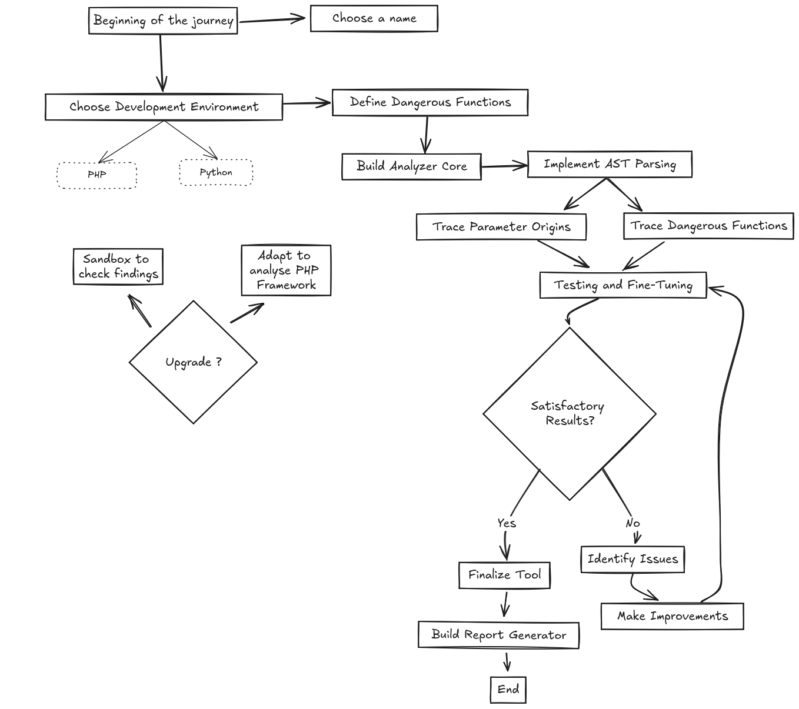

# PHP Analyzer Project

## Whoiam

I like to read lines of code and try to understand how it work and to find vulnerabilities.

 *It's me, trying to develop another sast tool.*

## Why am i developing another sast tool ?

- **Understand how sast tools works**
- **Get better at finding vulns in php code**
- **Code Review Automation**
- **Finding sinks is great, associated with sources will be better (i will try)**

## About the project

## Development

### 1. Development Environment

**Env:** PHP with Laravel, because I am more comfortable developing with this framework and what is better than php to analyze php!

### 2. Define Dangerous Functions

We need to create a list of dangerous functions in PHP, such as:
  - `eval()`
  - `exec()`
  - `system()`
  - `shell_exec()`
  - `passthru()`
  - `popen()`
  - `proc_open()`
  - `include()` and `require()` (when dealing with dynamic paths)
  - Database functions like `mysqli_query()` if you want to detect SQL injection vulnerabilities.

### 3. Build the Analyzer Core

1. **Parse PHP Files:** We will use a parser to convert PHP files into an Abstract Syntax Tree (AST).
2. **Analyze Function Calls:** Walk through the AST nodes to identify calls to dangerous functions.
3. **Trace Parameter Sources:** Check where the parameters of these functions are coming from. We need to trace variables back to their origin to detect if they come from user input (`$_GET`, `$_POST`, etc.) or other tainted sources.

### 4. Implement the AST Parsing

[PHP-Parser](https://github.com/nikic/PHP-Parser) by Nikita Popov is a library that can parse PHP code into an Abstract Syntax Tree (AST).

[token_get_all](https://www.php.net/token_get_all) parses the given code string into PHP language tokens using the Zend engine's lexical scanner ([Token list](https://www.php.net/manual/en/tokens.php)).

### 5. Tracing Parameter Origins

Tracing where parameters come from requires a bit more complexity:
- **Variable Tracking:** Track assignments to variables to trace their origins. If a variable is assigned a value from `$_GET`, `$_POST`, or any other user-controlled input, we need to mark it as tainted.
- **Function Parameter Propagation:** When functions pass parameters, we need to propagate taint status through function calls.
- **Complex Flows:** We need to handle conditional statements, loops, and include/require statements to accurately track the flow of data.

### 6. Build a Report Generator

Once we have a list of dangerous functions and their tainted parameters, we can generate a report:
- **Output Format:** JSON, HTML, or plain text.
- **Details to Include:** 
  - File name and line number;
  - Function name and parameters;
  - The source of each parameter (e.g., `$_GET['id']`);
  - Example of payload.

### 7. Testing and Fine-Tuning

- **Test Cases:** We need some PHP files with known vulnerabilities to test the tool against them.

- **Improve Detection:** Add more advanced features, like detecting SQL injections beyond simple cases, and handling more complex data flows.

### 8. Upgrade

- **Sandbox:** Use sandbox to test vulnerable code**.
- **PHP Framework:** Adapt the tool to analyse PHP framework (Laravel, Symfony) to retrieve routing and parameters.
- **IAST:** Maybe one day.

